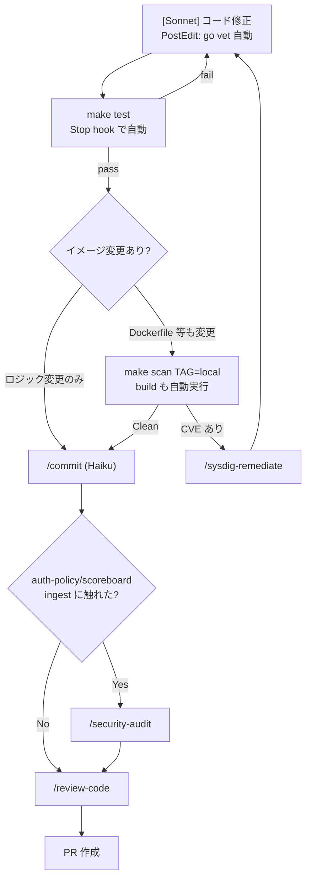
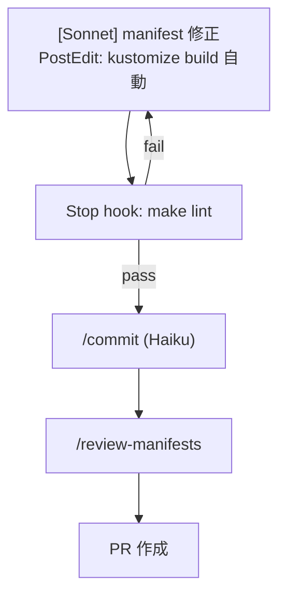
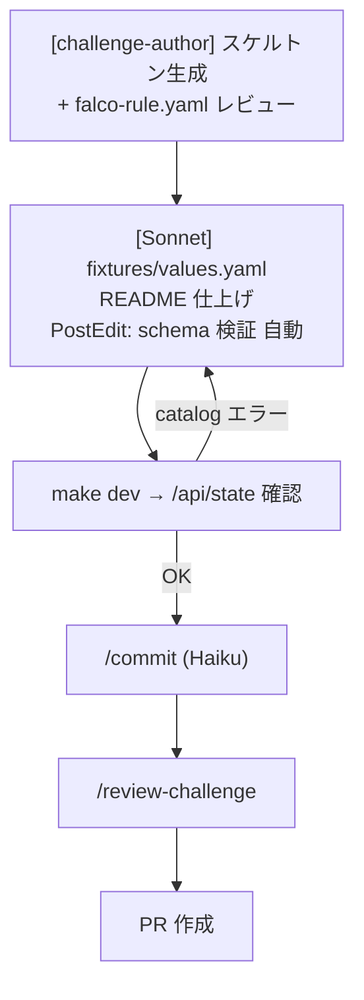
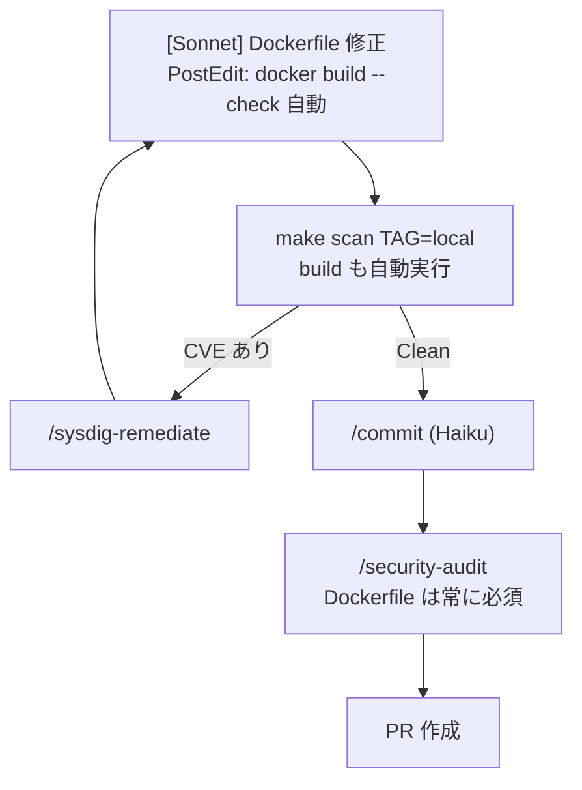

# 開発フロー正典 (dev-flow)

全変更パターンのフロー・ゲート・コマンドはここが唯一の正典。
CLAUDE.md は概要のみ持ち、詳細はこのファイルを参照する。

## パターン自動判定

`git diff --name-only main...HEAD` の結果から判定。
複数パターン混在時は優先順: **A > D > B > C**

| 変更ファイル | パターン |
|---|---|
| `cmd/**`, `internal/**`, `go.mod`, `go.sum`, `scoreboard/Dockerfile`, `auth-policy/Dockerfile` | **A: Go コード** |
| `images/*/Dockerfile`, `Dockerfile.test`, `Dockerfile.tidy`, `Dockerfile.gen` | **D: イメージ** |
| `deploy/**` のみ | **B: Manifest** |
| `challenges/**` のみ | **C: Challenge** |

Stop hook (`scripts/claude-hook-stop.sh`) がセッション終了時に自動判定して
必要なゲートを走らせる。

---

## パターン A: Go コード変更 (`cmd/`, `internal/`)



| ゲート | タイミング | 必須 | コマンド |
|---|---|---|---|
| go vet | PostEdit 自動 | ✅ | `scripts/claude-hook-postedit.sh` |
| make test | Stop 自動 | ✅ | `make test` |
| make scan | build 後 (手動) | イメージ変更時 | `make scan TAG=local` |
| /security-audit | PR 直前 | auth-policy/ingest 触れた時 | `/security-audit` |
| /review-code | PR 直前 | ✅ | `/review-code` |

---

## パターン B: Manifest 変更 (`deploy/`)



`make build` / `make scan` は不要 (イメージ変更なし)

| ゲート | タイミング | 必須 | コマンド |
|---|---|---|---|
| kustomize build | PostEdit 自動 | ✅ | `scripts/claude-hook-postedit.sh` |
| make lint | Stop 自動 | ✅ | `make lint` |
| /review-manifests | PR 直前 | ✅ | `/review-manifests` |

---

## パターン C: Challenge 追加 (`challenges/<NN>-<slug>/`)



`make build` / `make scan` は不要 (challenges/ はイメージ非依存)

| ゲート | タイミング | 必須 | コマンド |
|---|---|---|---|
| falco-rule.yaml schema | PostEdit 自動 | ✅ | `scripts/claude-hook-postedit.sh` |
| /api/state 確認 | 手動 | ✅ | `make dev` → curl /api/state |
| /review-challenge | PR 直前 | ✅ | `/review-challenge` |

---

## パターン D: イメージ変更 (`images/*/`, `Dockerfile.*`)



| ゲート | タイミング | 必須 | コマンド |
|---|---|---|---|
| docker build --check | PostEdit 自動 | ✅ | `scripts/claude-hook-postedit.sh` |
| make scan | 手動 | ✅ | `make scan TAG=local` |
| /security-audit | PR 直前 | ✅ 常に必須 | `/security-audit` |

---

## 全ゲート早見表

| ゲート | A | B | C | D |
|---|---|---|---|---|
| go vet (PostEdit) | ✅ 自動 | — | — | — |
| kustomize build (PostEdit) | — | ✅ 自動 | — | — |
| falco-rule schema (PostEdit) | — | — | ✅ 自動 | — |
| docker build --check (PostEdit) | — | — | — | ✅ 自動 |
| make test (Stop) | ✅ 自動 | — | — | — |
| make lint (Stop) | — | ✅ 自動 | — | — |
| scan 未実施 警告 (Stop) | イメージ変更時 | — | — | ✅ |
| secret 検出 (PreCommit) | ✅ blocking | ✅ blocking | ✅ blocking | ✅ blocking |
| make scan | イメージ変更時 | — | — | ✅ 必須 |
| /review-code | ✅ 必須 | — | ✅ 必須 | — |
| /review-manifests | — | ✅ 必須 | — | — |
| /review-challenge | — | — | ✅ 必須 | — |
| /security-audit | auth触れた時 | — | — | ✅ 必須 |

---

## CVE 調査・修正フロー (パターン A/D)

```bash
# make scan 後に scan-logs/ から resultId を確認
ls scan-logs/

# CVE 調査 (pipeline-only 環境: findings API が空になるため resultId から直接取得)
/headless-cloud-security:sysdig-investigate [image-name]

# CVE 修正 PR 生成
/headless-cloud-security:sysdig-remediate <image-name>
```

pipeline-only 環境では SysQL の findings API が空。
`scan-logs/` の resultId を使って `get_scan_result` で直接 CVE を取得すること。

---

## CI との役割分担

| チェック | ローカル | CI |
|---|---|---|
| go test | Stop hook 自動 | PR blocking |
| kustomize lint | Stop hook 自動 | PR blocking |
| image build | `make build` (scan に内包) | 全 PR |
| CVE scan | `make scan` — 主チェック | PR blocking (ttyd は暫定除外) |
| image push | なし | main マージ・tag push のみ |

ローカルの `make scan` が事実上の最終ゲート。CI scan は安全網。
