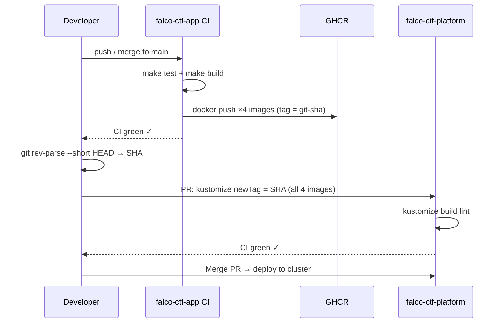

# Image Tag 更新手順（platform 側 pin）

## Cross-repo Flow



## 前提

- 当リポジトリ (`falco-ctf-app`) の main ブランチでビルドが完了
- CI (GitHub Actions `build-push.yaml`) が完走し、Sysdig scan が PASS

## 1. 使用する SHA を確認

```bash
git log --oneline -5          # 当リポジトリの最新 SHA
git rev-parse --short HEAD    # 7 文字 SHA
```

CI が push した tag = この SHA の最初の 7 文字（`steps.tag.outputs.tag`）。

## 2. ECR (将来) / 現在はローカルの場合

```bash
SHA=$(git rev-parse --short HEAD)
echo "Image tag to pin: $SHA"
```

## 3. falco-ctf-platform 側で kustomize imageTag を更新

```bash
# falco-ctf-platform リポジトリに移動
cd ../falco-ctf-platform

# scoreboard と auth-policy の両方を更新
kustomize edit set image \
  ghcr.io/<owner>/falco-ctf-scoreboard:${SHA} \
  ghcr.io/<owner>/falco-ctf-auth-policy:${SHA} \
  ghcr.io/<owner>/falco-ctf-ttyd:${SHA} \
  ghcr.io/<owner>/falco-ctf-challenge:${SHA}

# または直接 kustomization.yaml を編集して newTag を SHA に変更
```

## 4. platform 側 PR を作成

```bash
BRANCH="bump-image-${SHA}"
git checkout -b "$BRANCH"
git add deploy/
git commit -m "chore: bump image tags to ${SHA}"
gh pr create \
  --title "chore: bump image tags to ${SHA}" \
  --body "falco-ctf-app SHA: ${SHA}
  
Built images: scoreboard / auth-policy / ttyd / challenge
Sysdig scan: PASS (see Actions run)"
```

## 5. チェックリスト

- [ ] CI `build-push.yaml` が完走している
- [ ] Sysdig scan が 4 イメージすべて PASS
- [ ] platform 側 kustomization.yaml の `newTag` が SHA と一致
- [ ] `latest` タグが本番 overlay に入っていない（規約違反）
- [ ] platform 側 PR の CI が通っている
