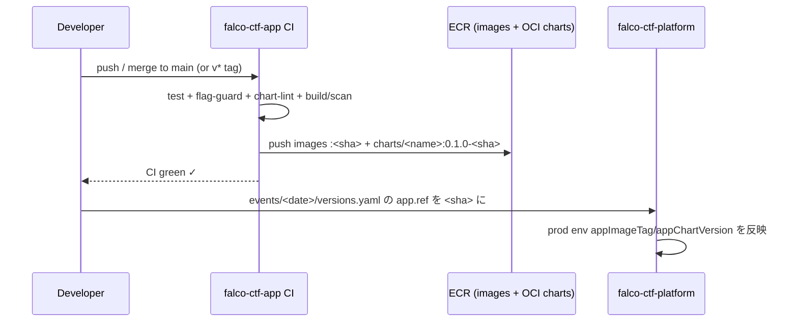

# App version pin 更新手順（platform 側）

イメージとチャートは CI が **同一 git SHA** で ECR (OCI) に publish する
(Invariant I5)。本番が使うバージョンは `falco-ctf-platform` の **1 箇所**でピンする。

## Cross-repo Flow



## 前提

- `falco-ctf-app` の main / tag で CI が完走（test / flag-guard / chart-lint /
  build+scan / publish-charts すべて green、Sysdig scan PASS）

## 1. 使用する SHA を確認

```bash
git -C ../falco-ctf-app rev-parse --short HEAD   # publish された image/chart tag
```

CI は images を `:<sha>`、charts を `0.1.0-<sha>` で publish 済み。

## 2. events/<date>/versions.yaml を更新

```yaml
app:
  repo: github.com/Qfour/falco-ctf-app
  ref: <sha>          # ← ここを更新
```

## 3. prod helmfile 値に反映

`helmfile/environments/prod.yaml.gotmpl`（または events/versions.yaml から供給）:

```yaml
appImageTag: "<sha>"
appChartVersion: "0.1.0-<sha>"
ecrRegistry: "<acct>.dkr.ecr.<region>.amazonaws.com"
```

確認:
```bash
cd helmfile && AWS_PROFILE=... helmfile -e prod template --selector name=scoreboard | grep image:
# → <registry>/falco-ctf/scoreboard:<sha> が出ること
```

## 4. チェックリスト

- [ ] app CI が完走（publish-charts 含む）、Sysdig scan 4 イメージ PASS
- [ ] `events/<date>/versions.yaml` の `app.ref` が SHA と一致
- [ ] prod の `appImageTag` / `appChartVersion` が SHA と整合
- [ ] `latest` を本番で使っていない（Invariant I4）
- [ ] images と charts が同一 SHA（Invariant I5）
