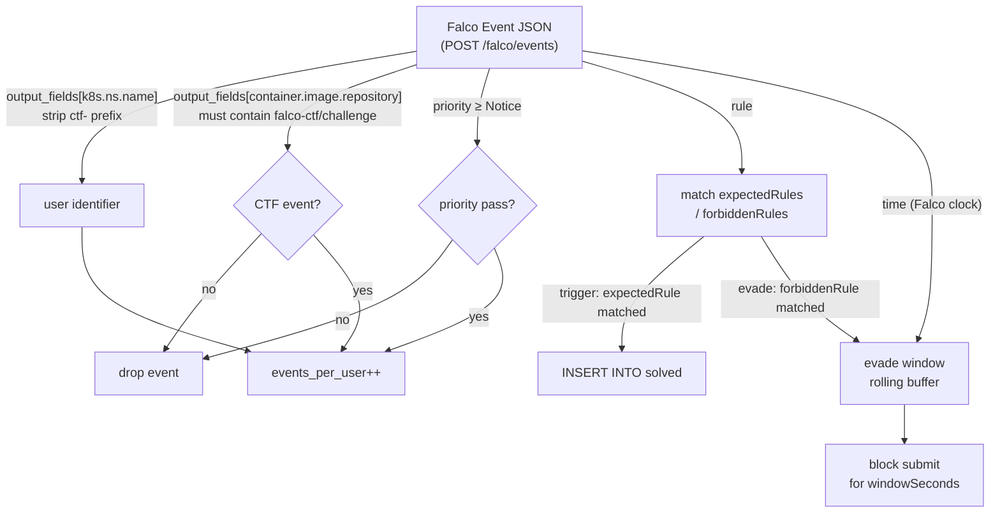

# AGENTS.md — falco-ctf-app

<!-- AI agent 共通指示。ツール固有機能は書かない。 -->

## Project Overview

- **Stack**: Go 1.23 (net/http + log/slog + embed) + distroless/Alpine Dockerfile + Kustomize
- **Direct Go deps**: `gopkg.in/yaml.v3` (catalog YAML), `modernc.org/sqlite` (pure-Go, CGO 不要)
- **Purpose**: Falco CTF のアプリ層(scoreboard / auth-policy / user-facing images / challenges)
- **Project label**: `falco-ctf`
- **Cross-repo**: 基盤は `falco-ctf-platform`

## Commands

```bash
# ローカル dev
make dev                                  # docker compose up (Go バイナリは image 内で build)
make dev-down

# image build / push
make build                                # 全イメージを REGISTRY=$REGISTRY TAG=$TAG で build
make push
make load-colima                          # colima k3s containerd に取込 (local only)

# colima にデプロイ
make deploy-local                         # kubectl apply -k deploy/*/overlays/local

# Go テスト (Docker 内で go vet + 全パッケージの go test ./...)
make test

# 依存更新 (go.mod 編集後 go.sum を host に export)
make tidy

# Kustomize 整合性チェック
make lint

# scoreboard 動作確認
curl -X POST http://localhost:8000/falco/events -H 'content-type: application/json' \
  -d '{"rule":"Read sensitive file untrusted","priority":"Warning",
       "output_fields":{"k8s.ns.name":"ctf-user1",
                        "k8s.pod.name":"workspace",
                        "container.image.repository":"falco-ctf/challenge"}}'
curl http://localhost:8000/api/state | jq
```

## Code Style

### File naming

- Go entry: `cmd/<app>/main.go` (起動・env パース・signal handling のみ)
- Go パッケージ: `internal/<pkg>/{<file>.go, <file>_test.go}`
  (テストは `<pkg>_test` 外部パッケージで書き、公開 API のみを exercise する)
- 埋め込みアセット: `internal/<pkg>/templates/*` を `//go:embed` で焼込
- Service Dockerfile: `<app>/Dockerfile` (build context = repo root)
- イメージのみ: `images/<name>/Dockerfile` (build context = `images/<name>/`)
- 課題: `challenges/<NN>-<slug>/` (NN は 2 桁ゼロパディング、slug は kebab-case)
- Kustomize: `deploy/<app>/{base,overlays/<env>}/kustomization.yaml`
- スクリプト: `scripts/<name>.sh` (kebab-case)

### Challenge ディレクトリ規約

```
challenges/<NN>-<slug>/
├── README.md            # 出題文 + ヒント + 想定解
├── fixtures/            # challenge コンテナへ仕込むファイル (ConfigMap 経由 mount)
├── falco-rule.yaml      # challengeId + type + expected/forbiddenRules (scoreboard が読む)
└── values.yaml          # (任意) ctf-user chart に重ねる Helm values overlay
```

`falco-rule.yaml` 必須フィールド:

```yaml
# trigger 型 (ルール発火で solved)
challengeId: "01-read-shadow"
type: trigger
expectedRules: ["Read sensitive file untrusted"]

# evade 型 (flag submit + 直近 windowSeconds 秒に forbidden 発火なしで solved)
challengeId: "02-evade-shadow-read"
type: evade
forbiddenRules: ["Read sensitive file untrusted"]
expectedFlag: "FALCO{...}"
windowSeconds: 10
```

### Dockerfile 規約

- scoreboard / auth-policy は multi-stage: builder = `golang:1.23-alpine`、最終 = `gcr.io/distroless/static-debian12:nonroot`
- ttyd / challenge は `alpine:3.20` 単段
- Go ビルドは `CGO_ENABLED=0 -ldflags="-s -w" -trimpath` で static binary
- runtime UID: scoreboard / auth-policy = **65532** (distroless nonroot)、ttyd = **1000**、challenge = **root** (CTF realism)
- scoreboard / auth-policy は build context = repo root (`COPY cmd/<app> ./cmd/<app>` + `COPY internal ./internal`)
- ttyd / challenge は build context = `images/<name>/`
- 詳細・SecurityContext は `.claude/rules/falco-ctf-app-conventions.md` 参照

### Kustomize 規約

- `base/` は環境非依存。host / domain は placeholder (`example.invalid`)
- `overlays/<env>/` で実値をパッチ
- `images:` field で tag を上書き(`newTag: <git-sha>`)

## Boundaries

制約の正典は `.claude/rules/falco-ctf-app-conventions.md`。
以下は最重要の禁則のみ再掲する。

- **Do NOT** scoreboard を replica >1 で動かす (SQLite 並行書込不可)
- **Do NOT** auth-policy の email 照合を prefix-exact から緩める
- **Do NOT** image tag を `latest` で本番 deploy
- **Do NOT** `git add .` / `git add -A`
- **Do NOT** Dockerfile / yaml に実シークレットを焼き込む

## Always

- ✅ scoreboard / auth-policy / ttyd / challenge の image tag は **同一 git SHA**
  (CI で一括 push)
- ✅ Go コード変更後は `make test` で全パッケージ(catalog / store / scoreboard / authpolicy)
  の単体テスト通過確認
- ✅ `go.mod` 編集後は `make tidy` で go.sum を更新してコミット
- ✅ challenge 追加時は scoreboard に動作確認(`POST /falco/events` で expected
  ルール → `/api/state` に solved 反映)
- ✅ Kustomize 編集後は `make lint` で全 overlay を `kustomize build`
- ✅ 機微情報は環境変数で渡す。Dockerfile / yaml にハードコードしない

## Falco event JSON フィールド早見表

| フィールド | 例 | 用途 |
|---|---|---|
| `output_fields["k8s.ns.name"]` | `ctf-user1` | ユーザ識別 |
| `output_fields["k8s.pod.name"]` | `workspace` | Pod 名 |
| `output_fields["container.image.repository"]` | `falco-ctf/challenge` | 課題種別 |
| `rule` | `Read sensitive file untrusted` | クリア判定キー |
| `priority` | `Warning` | フィルタ用 (notice 以上を採点対象) |
| `time` | `2026-05-08T07:15:32Z` | 重複イベント排除 |



## 関連リポジトリ

| Repo | 関係 |
|---|---|
| `falco-ctf-platform` | 基盤 (Falco / ingress / Dex / oauth2-proxy / cert-manager) + ctf-user chart + Terraform (EKS) |

## Git

- Commit messages: Conventional Commits
  例: `feat(scoreboard): add evade-type windowing`,
      `fix(auth-policy): tighten email prefix match`,
      `feat(challenge): add 06-pty-spawn`
- ブランチ戦略: `main` ← `feature/<ticket-id>-<slug>`
- PR スコープ: 1 サービス変更を 1 PR
