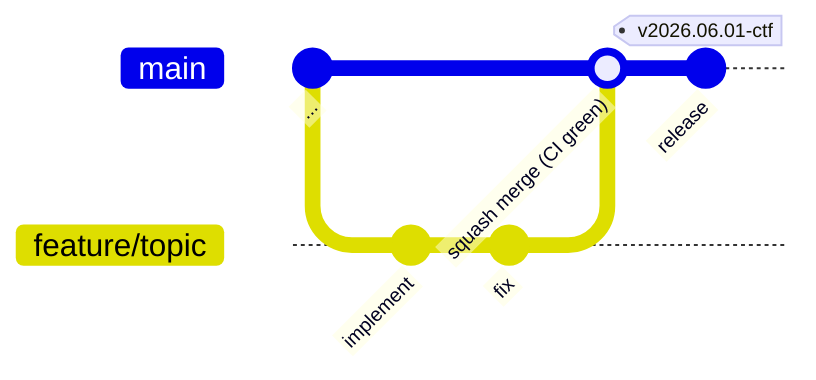

# CLAUDE.md — falco-ctf-app

## プロジェクト概要

Falco CTF のアプリケーション層。scoreboard / auth-policy / collector / ttyd /
challenge image と、出題コンテンツ (challenges/)、課題ドキュメントサイト (docs)、
`type: detect` 課題の capture-replay 採点イメージ (detect-grader) を持つ。
基盤(Falco, ingress, Dex, oauth2-proxy)と ctf-user chart は別リポジトリ
**`falco-ctf-platform`** にある。

## アーキテクチャ

```
falco-ctf-app/
├── cmd/                Go entry points (scoreboard / auth-policy / collector)。起動と wiring のみ
├── internal/           catalog (yaml ローダ、trigger/evade/detect、journey) / store (SQLite + state) /
│                       scoreboard (api・detect(local-exec/k8s Job)・scoring・ingest・
│                       ratelimit・metrics・httpx・view) / authpolicy (handlers) /
│                       collector (参加者向け forward proxy) / serverutil (共通 HTTP util)
├── scoreboard/         Dockerfile のみ (Go multi-stage, challenges/ 焼込)
├── auth-policy/        Dockerfile のみ (Go multi-stage, stdlib のみ)
├── collector/          Dockerfile のみ (Go multi-stage。参加者向け単一入口。
│                       submit/display-name/exfil の3本のみ scoreboard へ forward。
│                       me は非転送 (self-scope bypass を避ける設計判断)。CTF 状態は持たない)
├── images/{ttyd,challenge,docs,detect-grader}/  Dockerfile のみ
│                       (docs = MkDocs+PDF サイト、detect-grader = falco base + grade.sh
│                       による capture-replay 採点)
├── challenges/<NN>-<slug>/    README + falco-rule.yaml + rule.yaml + fixtures + values.yaml
│                       (rule.yaml = 表示用 Falco ルール抜粋。docs サイトが背景の後に描画。
│                       detect 型は falco-rule.yaml に evasion/benign capture パスを持つ)
├── docs-site/          MkDocs Material プロジェクト (gen-pages.py が challenges/ から
│                       ミッションページ生成 → images/docs が site+PDF を焼く)
├── charts/             Helm charts: scoreboard / auth-policy / collector / ctf-user / docs
│                       (platform helmfile が OCI/path で参照; k8s マニフェストの正典)
├── scripts/            build-and-load.sh (colima 用), mock-oauth2.conf
├── docker-compose.yml  ローカル dev (scoreboard + auth-policy + mock-oauth2)
├── Dockerfile.{test,tidy,gen}  bind mount 不要の `go test` / `go mod tidy` /
│                       oapi-codegen (colima 用)
├── go.mod / go.sum
└── Makefile            dev / build / test / tidy / gen / push / load-colima / deploy-local / scan
```

## 設計判断 (why, not what)

- **両サービス Go (旧 Python から刷新)** — auth-policy は認証 hot path、scoreboard
  は webhook 受信パス。image サイズとコールドスタートが効く層なので Go static binary
  に統一。SQLite は pure-Go の `modernc.org/sqlite` を採用して CGO 不要 (Alpine builder
  だけで完結)。HTML ダッシュボードは `embed.FS` で焼き込み、HTTP routing は
  `net/http` (1.22+ pattern routing) のみで chi/echo 不要。

- **scoreboard と challenges/ は同一 repo** — 採点ロジック(`expectedRules`)が
  challenge メタデータを直接読むので、リリースサイクルが完全一致。別 repo にすると
  scoreboard が古い challenge スキーマで動く事故が起きる。

- **scoreboard Dockerfile は repo root を context にする** — `COPY challenges/`
  でカタログをイメージに焼き込む。runtime で `/app/challenges` を volume mount
  すれば overlay 可能(local dev では compose で実体 mount)。

- **auth-policy は別サービス** — oauth2-proxy 単体では「認証済ユーザ = 全 workspace
  到達可」になる問題を解消するため。`X-Auth-Request-Email` を読んで
  `<username>@` 一致を確認する小さな Go サービス。

- **ttyd / challenge イメージはここに置く** — ユーザの体験面はアプリ層の責務。
  platform 側の ctf-user chart は image tag を values で pin するだけ。

- **chart `values.yaml` default は環境非依存** (Hard Invariant I7) — `host` や
  `EXPECTED_EMAIL_DOMAIN` の実値は platform helmfile が供給する。chart 側には
  placeholder (`example.invalid` / `docker.io/falco-ctf`) のみ入れる。
  (旧 Kustomize base/overlay 構成は P2 で廃止。k8s マニフェストの正典は `charts/`)

- **collector を参加者向け単一入口にする (P11.5)** — ctf-user の egress lockdown
  後、workspace が到達できる先を collector 1 つに絞る。collector は submit /
  display-name / exfil の3本を scoreboard へ verbatim forward するだけで CTF 状態
  (catalog / flags / DB) を持たない。**`GET /api/users/{user}/me` は意図的に
  非転送** (匿名で client 任意の `{user}` を読めると self-scope bypass になるため、
  進捗の読み取りは認証済みの journey host 経由に限定する — 出所は
  `docs/openapi-collector.yaml` の info description と `internal/collector/collector.go`
  のコメント。ADR-0005 はこの事実を parity gate の対象として扱うだけで、この
  決定自体は下していない — MEDIUM, 5x review)。scoreboard 自体を直接晒さないことで
  ingest 経路以外の攻撃面を減らす。

- **detect-grader を per-submission K8s Job にする** — `type: detect` 課題は
  参加者が書いた Falco `condition` を、事前録画した evasion/benign 2 capture に対して
  replay して採点する。参加者コードを実行するため、専用 grader namespace +
  deny-all NetworkPolicy + 非 root (65532) の使い捨て Job に隔離する
  (scoreboard 本体プロセスでは実行しない)。

- **Journey (ゲーム形式進行 UI, P15) は `/portal#journey` タブに統合済み
  (P19-2b で legacy `GET /journey`・`GET /me` を撤去)** — `internal/catalog/journey.go`
  が `challenges/<NN>-<slug>/journey.yaml` を読み、ブリーフィング/ステップ/段階ヒント/
  次ミッションへの誘導文をロードする。参加者向け *content* 専用で採点ロジックには
  一切影響しない (challenge の正典は `falco-rule.yaml`/catalog のまま)。journey.yaml
  が無い challenge は単に「ブリーフィング準備中」に degrade する (fail-soft)。
  `internal/scoreboard/view` が静的シェル (`GET /portal`) を返し、Journey/Me タブが
  `internal/scoreboard/api` の `GET /api/users/{user}/journey` (projection)・
  `POST .../steps/{idx}/check` (self-check)・`POST .../hints/{idx}` (progressive
  hint reveal)・`GET /api/users/{user}/me` をクライアントがポーリング/呼び出す。
  portal は admin-gate の対象外 (per-user API が self-scoped なため無害、`GET /` の
  admin dashboard のみ admin-gate 対象)。

- **docker-compose に mock-oauth2 を含める** — auth-policy 単体テストのため。
  本物の Dex を立てるコストを払わずに /check 経路が動く。

- **`Dockerfile.test` / `Dockerfile.tidy` / `Dockerfile.gen` を分離** — Colima は
  host repo path を VM に共有しないため `docker run -v` が効かない。代わりに
  build context 経由で `go test` / `go mod tidy` / oapi-codegen を実行し、
  tidy/gen は `--target export -o .` で go.mod/go.sum や生成コードを host に
  書き戻す。ローカル Go インストール不要で済む。

## クロスリポ契約 (falco-ctf-platform 側との接点)

**詳細・正典は `.claude/rules/falco-ctf-app-conventions.md` の「Cross-repo 契約」表**
(image naming の slash/dash 定義、detect-grader Job の RBAC/NetworkPolicy 契約を含む)。
概要のみ再掲:

| 接点 | 契約 |
|---|---|
| Image | `${REGISTRY}/falco-ctf-{scoreboard,auth-policy,collector,ttyd,challenge,docs,detect-grader}:<tag>`。tag は git SHA (全 7 イメージ同一 SHA、I5)。platform 側 chart/manifest が values で pin |
| detect-grader Job | scoreboard が `type: detect` 採点で per-submission K8s Job を起動。namespace/image/RBAC/NetworkPolicy の契約は conventions.md 参照 |
| Challenges path | platform の `deploy-user.sh --challenges-dir <path>` が当 repo の `challenges/` を指す。CI では sparse checkout |
| Webhook payload | `POST /falco/events` の JSON は falcosidekick 標準形。フィールドキー変更は両 repo 同時 PR |
| Cookie domain | `.<ctf-domain>` は platform が決定。app 側は前提とする |

## ブランチ戦略 (GitHub Flow + release タグ)



- **feature ブランチ命名**: `feature/<topic>` / `fix/<topic>` / `chal/<NN>-<slug>`
- **PR**: main への squash merge。CI (`test` / `chart-lint` / `flag-guard` /
  `build (<image>)` × 7 / `shellcheck` / `challenge-rules`) が必須 gate
- **リリース**: `git tag -a v<YYYY.MM.DD>[-<suffix>] -m "<message>"` → push
  - **`v*` タグ push は CI を発火させない** (Issue #37。CI trigger は main push /
    PR のみ)。タグは GitHub Release ノート生成 (`gh release create --generate-notes`
    が `.github/release.yml` のラベル分類を消費) のためだけに使う
  - image publish / chart publish は現状 CI-free prod 方針で `vars.ECR_REGISTRY`
    未設定時は main push でも skip。prod は images=手動 build/push、
    charts=local clone で運用中 (`project_ci_free_prod` 決定)
  - tag = 本番 deploy に使う image tag の記録用途 (Hard Invariant I4 は
    「git SHA を tag として使う」ことが本体で、release tag そのものではない)
- **hotfix**: `fix/<topic>` ブランチ → PR → squash → 新 tag を打ち直す

## Claude Code Workflow

**パターン別の詳細フロー・ゲート・コマンドは `.claude/rules/dev-flow.md` を参照。**

| やりたいこと | コマンド |
|---|---|
| ローカル全層起動 | `make dev` |
| テスト | `make test` |
| イメージビルド + colima 取込 | `make load-colima` |
| CVE スキャン | `make scan TAG=local` (`SYSDIG_SECURE_API_TOKEN` 必須) |
| CVE 調査 | `/headless-cloud-security:sysdig-investigate [image]` |
| CVE 修正 PR | `/headless-cloud-security:sysdig-remediate <image>` |
| 依存更新 | `go.mod` 編集後 `make tidy` |

**Sysdig 初回セットアップ**: シェルプロファイルに `SYSDIG_SECURE_URL=https://app.au1.sysdig.com` と `SYSDIG_SECURE_API_TOKEN` を追加する。

## Model routing (Claude Code)

デフォルトはセッション起動時のモデル (settings.json でのピン留めは廃止。
最新世代を推奨)。目的別にサブエージェントへ委譲する。
詳細は `.claude/rules/model-routing.md`。

| 用途 | 使うコマンド | モデル |
|---|---|---|
| 設計提案 / RCA / トレードオフ分析 | `/architect <topic>` | Opus |
| 実装・テスト追加 | main session のまま | Sonnet |
| pre-PR レビュー Go/manifest 両方 | `/review` | Opus |
| pre-PR レビュー Go のみ (パターン A/C) | `/review-code` | Opus |
| challenge レビュー (パターン C) | `/review-challenge` | Opus |
| セキュリティ深掘り | `/security-audit` | Opus |
| CVE 調査・優先度付け | `/headless-cloud-security:sysdig-investigate [image]` | Sonnet + Sysdig Skills |
| CVE 修正 PR 作成 | `/headless-cloud-security:sysdig-remediate <image>` | Sonnet + Sysdig Skills |
| git commit | `/commit` | Haiku |

注意:
- `/architect` の提案を受けたあと、**実装は main session に戻ってやる**
  (再委譲は context 二度払い)
- `/commit` は push しない (人間の判断で実行)
- 3 行の編集は agent に投げない (spawn オーバーヘッドが上回る)
