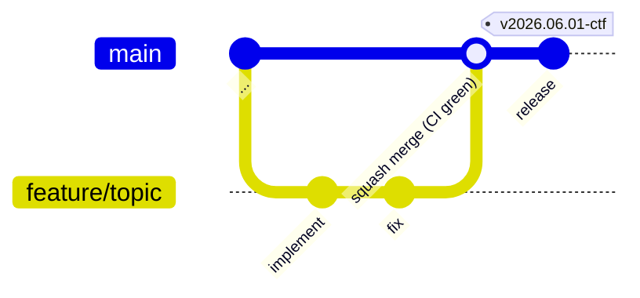

# CLAUDE.md — falco-ctf-app

## プロジェクト概要

Falco CTF のアプリケーション層。scoreboard / auth-policy / ttyd / challenge image
と、出題コンテンツ (challenges/) を持つ。基盤(Falco, ingress, Dex, oauth2-proxy)
と ctf-user chart は別リポジトリ **`falco-ctf-platform`** にある。

## アーキテクチャ

```
falco-ctf-app/
├── cmd/                Go entry points (scoreboard / auth-policy)。起動と wiring のみ
├── internal/           catalog (yaml ローダ) / store (SQLite + state) /
│                       scoreboard (handlers + HTML embed) / authpolicy (handlers)
├── scoreboard/         Dockerfile のみ (Go multi-stage, challenges/ 焼込)
├── auth-policy/        Dockerfile のみ (Go multi-stage, stdlib のみ)
├── images/{ttyd,challenge}/   Dockerfile のみ
├── challenges/<NN>-<slug>/    README + falco-rule.yaml + fixtures + values.yaml
├── deploy/<app>/{base,overlays/<env>}/   Kustomize
├── scripts/            build-and-load.sh (colima 用), mock-oauth2.conf
├── docker-compose.yml  ローカル dev (scoreboard + auth-policy + mock-oauth2)
├── Dockerfile.{test,tidy}  bind mount 不要の `go test` / `go mod tidy` (colima 用)
├── go.mod / go.sum
└── Makefile            dev / build / test / tidy / push / load-colima / deploy-local
```

## 設計判断 (why, not what)

- **両サービス Go (旧 Python から刷新)** — auth-policy は認証 hot path、scoreboard
  は webhook 受信パス。image サイズとコールドスタートが効く層なので Go static binary
  に統一。SQLite は pure-Go の `modernc.org/sqlite` を採用して CGO 不要 (Alpine builder
  だけで完結)。HTML ダッシュボードは `embed.FS` で焼き込み、HTTP routing は
  `net/http` (1.22+ pattern routing) のみで chi/echo 不要。

- **scoreboard と challenges/ は同一 repo** — 採点ロジック(`expectedRules`)が
  challenge メタデータを直接読むので、リリースサイクルが完全一致。別 repo にすると
  scoreboard が古い challenge スキーマで動く事故が起きる。

- **scoreboard Dockerfile は repo root を context にする** — `COPY challenges/`
  でカタログをイメージに焼き込む。runtime で `/app/challenges` を volume mount
  すれば overlay 可能(local dev では compose で実体 mount)。

- **auth-policy は別サービス** — oauth2-proxy 単体では「認証済ユーザ = 全 workspace
  到達可」になる問題を解消するため。`X-Auth-Request-Email` を読んで
  `<username>@` 一致を確認する小さな Go サービス。

- **ttyd / challenge イメージはここに置く** — ユーザの体験面はアプリ層の責務。
  platform 側の ctf-user chart は image tag を values で pin するだけ。

- **Kustomize は base = 環境非依存** — `host` や `EXPECTED_EMAIL_DOMAIN` は
  overlay でパッチ。base には placeholder (`example.invalid`) を入れる。

- **docker-compose に mock-oauth2 を含める** — auth-policy 単体テストのため。
  本物の Dex を立てるコストを払わずに /check 経路が動く。

- **`Dockerfile.test` / `Dockerfile.tidy` を分離** — Colima は host repo path を VM に
  共有しないため `docker run -v` が効かない。代わりに build context 経由で `go test` /
  `go mod tidy` を実行し、後者は `--target export -o .` で go.mod/go.sum を host に
  書き戻す。ローカル Go インストール不要で済む。

## クロスリポ契約 (falco-ctf-platform 側との接点)

| 接点 | 契約 |
|---|---|
| Image | `${REGISTRY}/falco-ctf-{ttyd,challenge,scoreboard,auth-policy}:<tag>`。tag は git SHA。platform 側 chart/manifest が values で pin |
| Challenges path | platform の `deploy-user.sh --challenges-dir <path>` が当 repo の `challenges/` を指す。CI では sparse checkout |
| Webhook payload | `POST /falco/events` の JSON は falcosidekick 標準形。フィールドキー変更は両 repo 同時 PR |
| Cookie domain | `.<ctf-domain>` は platform が決定。app 側は前提とする |

## ブランチ戦略 (GitHub Flow + release タグ)



- **feature ブランチ命名**: `feature/<topic>` / `fix/<topic>` / `chal/<NN>-<slug>`
- **PR**: main への squash merge。CI (test / build / lint-kustomize) が必須 gate
- **リリース**: `git tag -a v<YYYY.MM.DD>[-<suffix>] -m "<message>"` → push
  - tag push で CI が再ビルドし `v*` タグの image が push される
  - tag = 本番 deploy に使う image tag (Hard Invariant I4)
- **hotfix**: `fix/<topic>` ブランチ → PR → squash → 新 tag を打ち直す

## Claude Code Workflow

**パターン別の詳細フロー・ゲート・コマンドは `.claude/rules/dev-flow.md` を参照。**

| やりたいこと | コマンド |
|---|---|
| ローカル全層起動 | `make dev` |
| テスト | `make test` |
| イメージビルド + colima 取込 | `make load-colima` |
| CVE スキャン | `make scan TAG=local` (`SYSDIG_SECURE_API_TOKEN` 必須) |
| CVE 調査 | `/headless-cloud-security:sysdig-investigate [image]` |
| CVE 修正 PR | `/headless-cloud-security:sysdig-remediate <image>` |
| 依存更新 | `go.mod` 編集後 `make tidy` |

**Sysdig 初回セットアップ**: シェルプロファイルに `SYSDIG_SECURE_URL=https://app.au1.sysdig.com` と `SYSDIG_SECURE_API_TOKEN` を追加する。

## Model routing (Claude Code)

デフォルトはセッション起動時のモデル (settings.json でのピン留めは廃止。
最新世代を推奨)。目的別にサブエージェントへ委譲する。
詳細は `.claude/rules/model-routing.md`。

| 用途 | 使うコマンド | モデル |
|---|---|---|
| 設計提案 / RCA / トレードオフ分析 | `/architect <topic>` | Opus |
| 実装・テスト追加 | main session のまま | Sonnet |
| pre-PR レビュー Go/manifest 両方 | `/review` | Opus |
| pre-PR レビュー Go のみ (パターン A/C) | `/review-code` | Opus |
| challenge レビュー (パターン C) | `/review-challenge` | Opus |
| セキュリティ深掘り | `/security-audit` | Opus |
| CVE 調査・優先度付け | `/headless-cloud-security:sysdig-investigate [image]` | Sonnet + Sysdig Skills |
| CVE 修正 PR 作成 | `/headless-cloud-security:sysdig-remediate <image>` | Sonnet + Sysdig Skills |
| git commit | `/commit` | Haiku |

注意:
- `/architect` の提案を受けたあと、**実装は main session に戻ってやる**
  (再委譲は context 二度払い)
- `/commit` は push しない (人間の判断で実行)
- 3 行の編集は agent に投げない (spawn オーバーヘッドが上回る)
