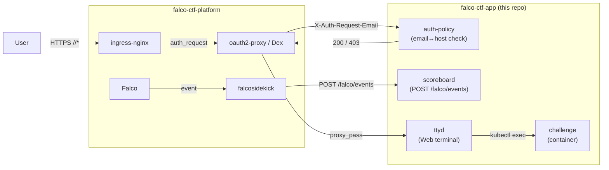

# falco-ctf-app

Falco CTF のアプリケーション層。scoreboard / auth-policy / 参加者環境用
イメージ (ttyd / challenge) と、出題コンテンツ (challenges/) を持つ。

基盤(Falco, ingress-nginx, Dex, oauth2-proxy, cert-manager)とユーザ workspace
払い出し chart は **`falco-ctf-platform`** にある。

## System Architecture



## 構成

```
falco-ctf-app/
├── scoreboard/         FastAPI 採点サービス (Falco webhook 受信)
├── auth-policy/        FastAPI host↔email 認可サービス
├── images/
│   ├── ttyd/           ユーザが触る Web ターミナル
│   └── challenge/      challenge コンテナのベースイメージ
├── challenges/<NN>-<slug>/
│   ├── README.md       出題文 + 想定解 (operator/author 向け)
│   ├── falco-rule.yaml scoreboard が読む期待ルール定義
│   ├── fixtures/       参加者向けファイル (challenge イメージに焼込)
│   ├── plant.sh        (evade) フラグ仕込み単一ソース → make gen-values
│   └── values.yaml     (生成物) ctf-user chart の postStart overlay
├── charts/             Helm charts (platform helmfile が参照)
│   ├── scoreboard/  auth-policy/  ctf-user/
├── scripts/
│   ├── build-and-load.sh  colima k3s 用イメージ取込
│   └── mock-oauth2.conf   ローカル dev 用 oauth2-proxy モック
├── docker-compose.yml  ローカル dev (scoreboard + auth-policy + mock)
├── Makefile            dev / build / push / deploy
└── .github/workflows/  build-push.yaml + Kustomize lint
```

## ローカル開発

```bash
# scoreboard + auth-policy を hot-reload で起動
make dev

# Falco event を直接送って採点ロジックを試す
curl -X POST http://localhost:8000/falco/events \
  -H 'content-type: application/json' \
  -d '{"rule":"Read sensitive file untrusted","priority":"Warning",
       "output_fields":{"k8s.ns.name":"ctf-user1",
                        "container.image.repository":"falco-ctf/challenge"}}'
curl http://localhost:8000/api/state | jq

# auth-policy /check を試す (mock-oauth2 が常に 202)
curl -i http://localhost:8001/check?host=user1
```

## colima k3s への deploy

`falco-ctf-platform` 側で `./scripts/install-all.sh` が通っている前提:

```bash
make load-colima          # build → colima containerd へ取込
make deploy-local         # helm upgrade --install scoreboard + auth-policy (app のみ)
# full local stack は falco-ctf-platform で: helmfile -e local apply
```

## イメージ

| Image | 用途 | 消費側 |
|---|---|---|
| `scoreboard` | Falco webhook 受信 + ユーザ×課題マトリクス | `charts/scoreboard/` |
| `auth-policy` | ingress-nginx auth-url 前段 (host↔email) | `charts/auth-policy/` |
| `ttyd` | Web ターミナル (kubectl exec バックエンド) | `charts/ctf-user/` |
| `challenge` | challenge コンテナのベースイメージ | `charts/ctf-user/` |

本番 (EKS) では GHCR から pull。tag は git SHA。

## 関連リポジトリ

| Repo | 役割 |
|---|---|
| `falco-ctf-platform` | 基盤 (Falco / ingress / Dex / oauth2-proxy / cert-manager) + ctf-user chart + Terraform (EKS) |
