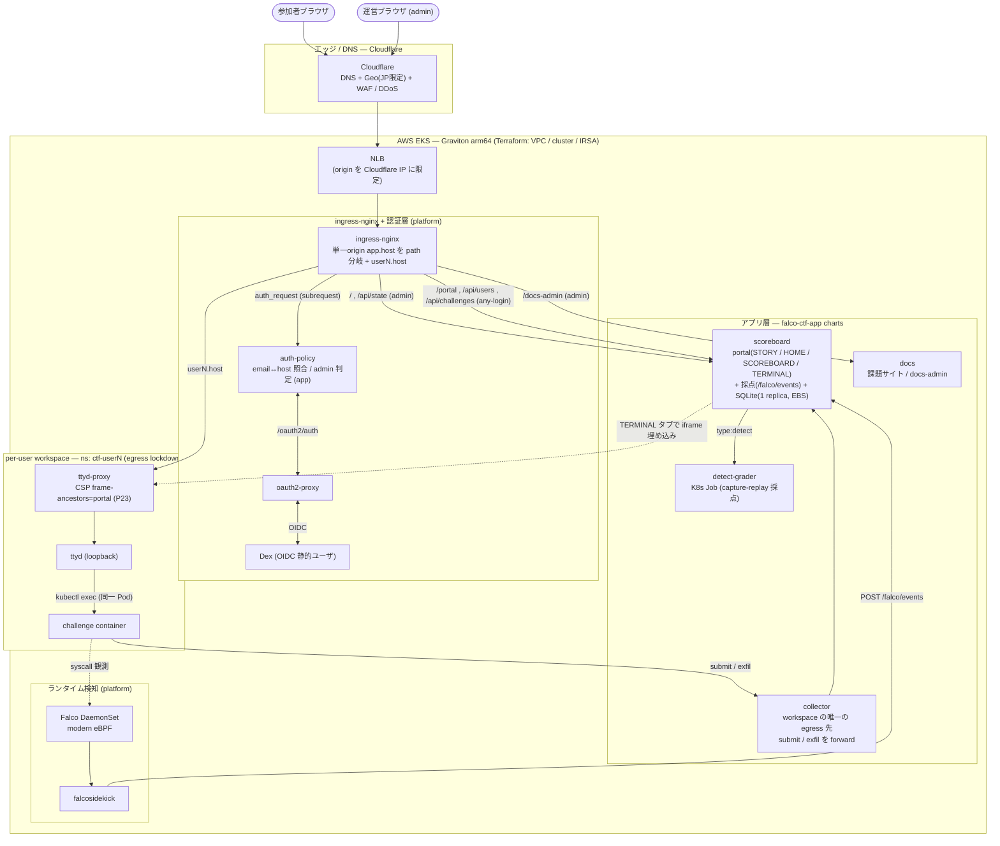

# falco-ctf-app

Falco CTF のアプリケーション層。scoreboard / auth-policy / collector と、
参加者環境用イメージ (ttyd / challenge)、課題ドキュメントサイト (docs)、
`type: detect` 課題の capture-replay 採点イメージ (detect-grader)、
出題コンテンツ (challenges/) を持つ。

基盤(Falco, ingress-nginx, Dex, oauth2-proxy, cert-manager)とユーザ workspace
払い出し chart は **`falco-ctf-platform`** にある。

## System Architecture

参加者は Web ターミナル(ttyd)で配布された同一環境の課題を操作し、その syscall を
Falco が検知 → scoreboard がユーザ別に集計する。本番は AWS EKS(Graviton arm64,
Terraform 管理)、エッジは Cloudflare(DNS + Geo/WAF/DDoS)、認証は oauth2-proxy + Dex。
固定サービス(admin ダッシュボード / 参加者ポータル / docs-admin)は**単一 origin**
`app.<host>` を path で分岐し、ttyd だけは per-user サブドメイン `userN.<host>` に残す。



## 構成

```
falco-ctf-app/
├── cmd/                Go entry points (scoreboard / auth-policy / collector)
├── internal/           catalog / store / scoreboard (api・detect・scoring・ingest 等) /
│                       authpolicy / collector
├── scoreboard/         Dockerfile のみ (Go multi-stage, Falco webhook 受信 + 採点)
├── auth-policy/        Dockerfile のみ (Go multi-stage, host↔email 認可)
├── collector/          Dockerfile のみ (Go, 参加者向け単一入口。submit/me/exfil を
│                       scoreboard へ forward。CTF 状態は持たない)
├── images/
│   ├── ttyd/           ユーザが触る Web ターミナル
│   ├── challenge/      challenge コンテナのベースイメージ
│   ├── docs/           課題ドキュメントサイト (MkDocs Material + per-mission PDF)
│   └── detect-grader/  `type: detect` 課題の capture-replay 採点 (falco base + grade.sh)
├── challenges/<NN>-<slug>/
│   ├── README.md       出題文 + 想定解 (operator/author 向け)
│   ├── falco-rule.yaml scoreboard が読む期待ルール定義 (trigger/evade/detect)
│   ├── fixtures/       参加者向けファイル (challenge イメージに焼込)
│   ├── plant.sh        (evade) フラグ仕込み単一ソース → make gen-values
│   └── values.yaml     (生成物) ctf-user chart の postStart overlay
├── docs-site/          MkDocs Material プロジェクト (gen-pages.py が challenges/ から
│                       ミッションページ生成 → images/docs が site+PDF を焼く)
├── charts/             Helm charts (platform helmfile が参照)
│   ├── scoreboard/  auth-policy/  collector/  ctf-user/  docs/
├── scripts/
│   ├── build-and-load.sh  colima k3s 用イメージ取込
│   └── mock-oauth2.conf   ローカル dev 用 oauth2-proxy モック
├── docker-compose.yml  ローカル dev (scoreboard + auth-policy + mock)
├── Makefile            dev / build / push / deploy / test / lint / scan
└── .github/workflows/  ci.yaml (test / chart-lint / flag-guard / build+scan / publish-charts)
```

## ローカル開発

```bash
# scoreboard + auth-policy を hot-reload で起動
make dev

# Falco event を直接送って採点ロジックを試す
curl -X POST http://localhost:8000/falco/events \
  -H 'content-type: application/json' \
  -d '{"rule":"Read sensitive file untrusted","priority":"Warning",
       "output_fields":{"k8s.ns.name":"ctf-user1",
                        "container.image.repository":"falco-ctf/challenge"}}'
curl http://localhost:8000/api/state | jq

# auth-policy /check を試す (mock-oauth2 が常に 202)
curl -i http://localhost:8001/check?host=user1
```

## colima k3s への deploy

`falco-ctf-platform` 側で `./scripts/install-all.sh` が通っている前提:

```bash
make load-colima          # build → colima containerd へ取込
make deploy-local         # helm upgrade --install scoreboard + auth-policy (app のみ)
# full local stack は falco-ctf-platform で: helmfile -e local apply
```

## イメージ

全 7 イメージを同一 git SHA でビルド・push する (Hard Invariant I5)。

| Image | 用途 | 消費側 |
|---|---|---|
| `scoreboard` | Falco webhook 受信 + ユーザ×課題マトリクス + 採点 | `charts/scoreboard/` |
| `auth-policy` | ingress-nginx auth-url 前段 (host↔email) | `charts/auth-policy/` |
| `collector` | 参加者向け単一入口 (submit/me/exfil を scoreboard へ forward) | `charts/collector/` |
| `ttyd` | Web ターミナル (kubectl exec バックエンド) | `charts/ctf-user/` |
| `challenge` | challenge コンテナのベースイメージ | `charts/ctf-user/` |
| `docs` | 課題ドキュメントサイト (MkDocs Material + PDF) | `charts/docs/` |
| `detect-grader` | `type: detect` 課題の capture-replay 採点 (K8s Job) | scoreboard が起動 |

本番 (EKS) では ECR から pull (OCI helm chart も含む)。tag は git SHA。

## 関連リポジトリ

| Repo | 役割 |
|---|---|
| `falco-ctf-platform` | 基盤 (Falco / ingress / Dex / oauth2-proxy / cert-manager) + ctf-user chart + Terraform (EKS) |
