# scoreboard SQLite schema

Authoritative source: `internal/store/store.go`. This document mirrors
that source — if they disagree, **the Go code wins**. Update both in
the same PR.

## Connection

```
file = $SCOREBOARD_DB                                   default /var/lib/scoreboard/scoreboard.db
DSN  = <file>?_pragma=journal_mode(WAL)
                &_pragma=synchronous(NORMAL)
                &_pragma=busy_timeout(5000)
```

- WAL → reader-writer concurrency, durable on crash
- `synchronous=NORMAL` → trade a small durability risk on power loss for
  ~10× write throughput. Acceptable: a CTF run is short and the
  authoritative state (`/api/state`) is recomputed from this DB
- `busy_timeout=5000` → block up to 5 s on contention before erroring
  (single-writer process so this rarely matters in practice)

## Driver

`modernc.org/sqlite` — pure-Go translation of SQLite C. CGO not
required. Static binary builds with `CGO_ENABLED=0` work. Performance
is acceptable at CTF scale (50 users, < 100 events/s peak). For a
significant scale-up, switch to mattn/go-sqlite3 or migrate to
PostgreSQL (see "Migration paths" below).

## Schema Overview

```mermaid
erDiagram
    solved {
        TEXT user PK "extracted from ctf-<username> namespace"
        TEXT challenge PK "catalog id e.g. 01-read-shadow"
        TEXT at "RFC3339Nano UTC — receipt time for trigger, submit time for evade"
    }
    display_names {
        TEXT user PK
        TEXT name
        TEXT set_at
    }
    hint_release {
        TEXT mission PK
        INTEGER hint PK "1-based hint index, operator-released"
        TEXT at
    }
    exfil {
        TEXT user PK
        TEXT challenge PK
        TEXT flag "collector-delivered value, last-write-wins"
        TEXT at
    }
    hint_views {
        TEXT user PK
        TEXT challenge PK
        INTEGER hint_idx PK "1-based, participant self-revealed"
        TEXT at
    }
    step_checks {
        TEXT user PK
        TEXT challenge PK
        INTEGER step_idx PK
        TEXT at
    }
    evade_dirty {
        TEXT user PK
        TEXT challenge PK
        TEXT rule PK "one forbidden rule name that fired"
        TEXT at
    }
    ruleFires["ruleFires (in-memory only)"] {
        TEXT user PK
        TEXT rule
        FLOAT unix_seconds "server receipt time — presentational only"
    }
    eventsPerUser["eventsPerUser (in-memory only)"] {
        TEXT user PK
        INTEGER count "monotonic, dashboard display only"
    }

    solved }o--|| exfil : "same (user, challenge) key space"
    evade_dirty }o--|| exfil : "same (user, challenge) key space"
```



`ruleFires` and `eventsPerUser` are in-memory only, reset on every
scoreboard restart — see "In-memory only" below. Every other table above
is a real SQLite table, loaded into an in-memory mirror at startup
(`loadFromDB`) and kept in sync on every write.

## Tables

### `solved`

One row per (user, challenge) — the user-visible "Alice solved
`01-read-shadow` at 2026-05-11T10:00Z" record. **First-solve wins**:
re-firing the same trigger does not update `at`.

```sql
CREATE TABLE solved (
  user      TEXT NOT NULL,
  challenge TEXT NOT NULL,
  at        TEXT NOT NULL,             -- RFC3339Nano UTC
  PRIMARY KEY (user, challenge)
);
```

| column      | type | semantics                                                       |
|-------------|------|-------------------------------------------------------------------|
| `user`      | TEXT | extracted from `ctf-<username>` namespace                       |
| `challenge` | TEXT | catalog id (e.g. `01-read-shadow`)                              |
| `at`        | TEXT | **scoreboard receipt time** for trigger solves; **submit time** for evade/detect solves. Falco's `time` field is **not** used here on purpose — see ADR below |

Writes: `INSERT OR IGNORE` (idempotent — first solve wins).
Reads: full table scan into memory at startup, then incremental
updates kept in `Store.solved` in process memory. Snapshots come from
the in-memory map (the DB is the persistence backing store, not a
query target). `Store.IsSolved` (ADR-0003 A1) reads this same map for
the Grader's attempt-scope current() derivation.

### `display_names`

Participant/operator-set leaderboard display name. Last-write-wins
(participant self-service `POST /api/users/{user}/display-name`
first-set-only; the admin path `POST /api/admin/users/{user}/display-name`
may always override).

```sql
CREATE TABLE display_names (
  user   TEXT PRIMARY KEY,
  name   TEXT NOT NULL,
  set_at TEXT NOT NULL
);
```

### `hint_release`

Operator-controlled per-mission hint release gate (a hint index is not
even offerable to participants until the operator releases it). Distinct
from `hint_views` below (which records a specific participant's own
reveal). Not currently wired to a public API surface beyond the internal
`ReleaseHint`/`ReleasedHints` store methods.

```sql
CREATE TABLE hint_release (
  mission TEXT NOT NULL,
  hint    INTEGER NOT NULL,
  at      TEXT NOT NULL,
  PRIMARY KEY (mission, hint)
);
```

### `exfil`

One row per (user, challenge) — the collector's most recent flag
delivery receipt for a `requireExfil` evade challenge (the boss capstone,
`10-final-exfil`). Last-write-wins (`ON CONFLICT DO UPDATE`), unlike
`solved`'s first-write-wins.

```sql
CREATE TABLE exfil (
  user      TEXT NOT NULL,
  challenge TEXT NOT NULL,
  flag      TEXT NOT NULL,
  at        TEXT NOT NULL,
  PRIMARY KEY (user, challenge)
);
```

`HasExfil` requires an EXACT flag match (the solve gate); `HasExfilAny`
is flag-agnostic (drives the Journey UI's "collector received your flag"
live status without leaking the value). `PendingExfilSolves` enumerates
every row here whose pair is not yet in `solved` — the auto-solve
Sweeper's (P16) work queue.

**ADR-0003 A2-2 (CEO enforce decision, 2026-08-18):** `ResetDirty` (below)
deletes a pair's `exfil` row in the SAME call that clears its
`evade_dirty` rows. A reset restarts the WHOLE attempt — a `requireExfil`
challenge needs a brand-new delivery after a reset, not just a clean
taint (otherwise "fire a forbidden rule → reset → the Sweeper auto-solves
off the stale receipt" reopens the App-H2 exploit through a different
door).

### `hint_views`

Journey UI: per-participant hint reveals (progressive hint gating, #40's
per-hint-index score penalty schedule prices these). Idempotent —
re-revealing an already-opened hint is a no-op.

```sql
CREATE TABLE hint_views (
  user      TEXT NOT NULL,
  challenge TEXT NOT NULL,
  hint_idx  INTEGER NOT NULL,
  at        TEXT NOT NULL,
  PRIMARY KEY (user, challenge, hint_idx)
);
```

### `step_checks`

Journey UI: per-participant self-check ticks for a mission's `steps`.
Presentational only (a step tick never contributes to the solve
verdict — that stays with `solved` / trigger fire / evade flag).

```sql
CREATE TABLE step_checks (
  user      TEXT NOT NULL,
  challenge TEXT NOT NULL,
  step_idx  INTEGER NOT NULL,
  at        TEXT NOT NULL,
  PRIMARY KEY (user, challenge, step_idx)
);
```

### `evade_dirty`

App-H2 + **ADR-0003 (attempt scope)**: the evade solve gate's
forbidden-rule taint. A row's mere EXISTENCE means (user, challenge) is
dirty — there is no expiry, no `windowSeconds` lookback (that field was
removed from the catalog schema by ADR-0003; it never gated a solve
decision even before removal — see the ADR), and no "clean again after N
seconds".

```sql
CREATE TABLE evade_dirty (
  user      TEXT NOT NULL,
  challenge TEXT NOT NULL,
  rule      TEXT NOT NULL,
  at        TEXT NOT NULL,
  PRIMARY KEY (user, challenge, rule)
);
```

A row is only ever written for the participant's CURRENT mission
(`scoring.Grader.markDirtyOnRuleFire` — ADR-0003 §A1: attempt scope). Once
written, the pair stays dirty FOREVER until `ResetDirty` explicitly
deletes it — no amount of waiting clears a persisted row, and (I1: single
replica, `Recreate` strategy) a scoreboard restart reloads this table from
disk exactly like `solved` and `exfil` do, so a restart cannot resurrect
the old "wait it out" or "restart auto-solves everything" exploits (App-H2
exploits #1 and #2).

`MarkDirty` is **fail-closed** (ADR-0003 A5): the in-memory taint
(`Store.dirtyRules`) is set BEFORE the SQL write is attempted, and stays
set even if that write errors — an over-taint is recoverable via
`ResetDirty`; a taint silently never set because of a transient DB error
is not.

## In-memory only (NOT in SQLite)

- **`Store.ruleFires`** — a `map[user] -> []ruleFire{rule, unix_seconds}`,
  bounded to the last `RetentionSeconds` (= 300) **per user**. Purely
  presentational: the Journey UI's trigger "you just fired X"
  `detectedRules` live-status projection (`triggerDetectWindowSeconds =
  60` in `internal/scoreboard/api/api.go`) and the participant `/me`
  recent-fires feed. It backs **no solve decision** — the evade
  forbidden-rule gate is the persisted `evade_dirty` taint above, and the
  trigger solve verdict is recorded by `ingest` the instant a matching
  rule fires, independent of this map. Reset on every restart is
  acceptable because nothing scoring-relevant depends on it surviving one.
- **`Store.eventsPerUser`** — `map[user] -> count`, the dashboard's
  "Events" column. Explicitly `DROP TABLE IF EXISTS events_per_user` runs
  on every `Open()` (a prior persisted version of this table is dropped
  on upgrade) — this counter is display-only and resets to 0 on restart.

Why not persisted: both are cheap-to-lose display aids on the ingest hot
path (`ruleFires` is written on *every* Falco event); persisting either
would cost SQLite write throughput for no scoring benefit.

## ADR: solve `at` is receipt time, not Falco time

Original design (Python era, ported initially to Go) used Falco's
`time` field for `solved.at`. Falco / falcosidekick can buffer or
batch events; with a stale `time`, the dashboard would show "20m ago"
right after a successful trigger.

Now: `at` = `time.Now()` at receipt (`ingest.receive` in Go), for BOTH
the trigger solve timestamp and the evade taint timestamp
(`evade_dirty.at`). There is no windowed evade check that keys off
Falco's `time` at all — that was true even before ADR-0003 removed the
catalog's `windowSeconds` field (the field had already stopped gating any
decision as of App-H2/PR #124; the correction below fixes a
long-standing factual error in an earlier revision of this document,
which claimed otherwise).

Test: `TestFalcoEvents_SolveTimestampUsesReceiptTime`.

## Invariants

1. **Single writer.** Scoreboard runs with `replicas: 1, strategy:
   Recreate`. Multiple writers would corrupt the in-memory state and
   conflict on `INSERT OR IGNORE` semantics for first-solve tracking
2. `solved` rows are append-only. We never `UPDATE solved` after
   insert (use `INSERT OR IGNORE` to enforce first-solve-wins)
3. `events_per_user` (in-memory) is monotonic non-decreasing
4. `at` strings are RFC3339Nano UTC — string comparison gives correct
   chronological ordering (relied on by the leaderboard tiebreaker)
5. Catalog ids (`solved.challenge`, `evade_dirty.challenge`, `exfil.challenge`,
   …) are case-sensitive matches against the keys of
   `internal/catalog.Catalog`. Renaming a challenge directory orphans
   rows — handle via a one-off SQL migration in the release notes
6. **`evade_dirty` is attempt-scoped, not global** (ADR-0003 A1): a row
   only exists because a forbidden rule fired while that (user, challenge)
   pair was the participant's CURRENT mission. `ResetDirty` is the ONLY
   way back to clean, and it ALSO deletes the pair's `exfil` row (A2-2) —
   never assume `evade_dirty` and `exfil` can be reset independently

## Migration history

| Version | Date       | Change                                                        |
|---------|------------|---------------------------------------------------------------|
| v1      | 2026-05-08 | Initial schema (`solved`, `events_per_user`). Inherited from the Python implementation; Go port preserves the schema exactly so existing PVC data carries over without migration |
| v1.1    | 2026-06-08 through 2026-07-13 | Incremental additions as participant-facing features landed: `display_names` (operator + self-service leaderboard names), `hint_release` (operator-released hints), `exfil` (P16 auto-solve receipts), `hint_views` + `step_checks` (P15 Journey UI). `events_per_user` table dropped in favour of an in-memory-only counter (display-only, no scoring impact) — see "In-memory only" above |
| v2      | 2026-08-18 | App-H2 (PR #124): `evade_dirty` added (persistent evade forbidden-rule taint), replacing the old in-memory `ruleFires`-windowed evade gate |
| v2.1    | 2026-08-18 | ADR-0003 (attempt scope, same-day follow-up after PR #124 was found to block every regular participant — see the ADR): no schema change. `evade_dirty` writes are now scoped to the participant's CURRENT mission (was: unconditional fan-out to every evade challenge sharing the fired rule name — #124's regression). `ResetDirty` now also deletes the pair's `exfil` row (A2-2 enforce decision) |

## Migration paths (when scale demands)

| Trigger                                | Move to                                    |
|----------------------------------------|--------------------------------------------|
| Need > 1 scoreboard replica            | PostgreSQL + extract `ruleFires` to Redis  |
| Read-path latency > 100ms p99          | SQLite snapshot + read-replica process     |
| Multi-tenant (multiple CTF instances)  | DB-per-tenant or schema-per-tenant         |

None of these are needed today.

## Inspecting live data

```bash
# Inside the running pod (read-only — DON'T modify the live DB by hand):
kubectl exec -n scoreboard deploy/scoreboard -- \
  sh -c 'apk add --no-cache sqlite >/dev/null 2>&1 || true; \
         sqlite3 /var/lib/scoreboard/scoreboard.db ".tables"'

# Pull a copy locally:
kubectl cp scoreboard/<pod>:/var/lib/scoreboard/scoreboard.db ./scoreboard.db
sqlite3 ./scoreboard.db 'SELECT user, challenge, at FROM solved ORDER BY at;'
sqlite3 ./scoreboard.db 'SELECT user, challenge, rule, at FROM evade_dirty;'
```

The `apk add sqlite` only works on the Alpine final stage — fine for
debug but not part of the image build.
